### Map问题

#### Map无序问题

1. 正常写入(非哈希冲突写入) 是hash到某一个bucket上面 而不是按照buckets顺序写入 虽然buckets是一块连续的内存 但是新写入的键值可能写到这个bucket 也可能写到其他的bucket上面
2. 哈希冲突写入 如果存在哈希冲突 就会写到同一个bucket上面 可能是一个bmap的elems任何位置 甚至可能是溢出桶里面

### Map扩容问题 


Go的Map扩容有两种: 1. 成倍扩容 2. 等量扩容 

当map写操作的时候 会触发成倍扩容 
当元素数量或者bucket数量大于6.5的时候 也会触发成倍扩容 

成倍扩容的过程:
1. 原始的buckets被指向oldbuckets
2. 重新初始化成倍的新的buckets指向buckets
3. 写操作触发扩容
4. 每次仅仅扩容当前的键对应的bucket(bmap)
5. 原先的bmap被分流到两个新的bucket(bmap)中间

当bmap的溢出桶数量 大于等于2*B的时候 触发等量扩容  是为了整理溢出的桶 回收冗余的溢出桶 

等量扩容不会修改元素的顺序

```text
// 等量扩容判断
func tooManyOverflowBuckets(noverflow uint16, B uint8) bool {
	// 复习下B的含义：count(buckets) = 2^B
	if B > 15 {
		B = 15
	}
	// 溢出桶的数量大于等于 2*B时 触发等量扩容
	return noverflow >= uint16(1)<<(B&15)
}
```


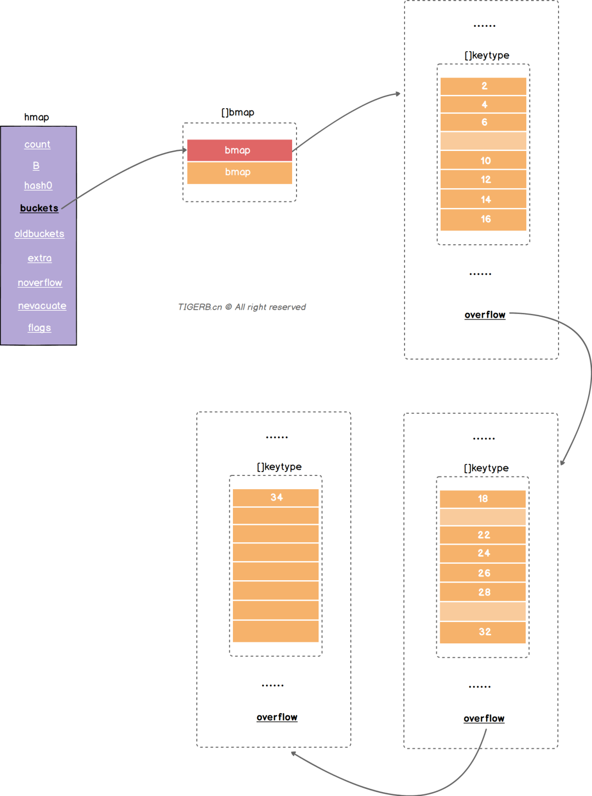

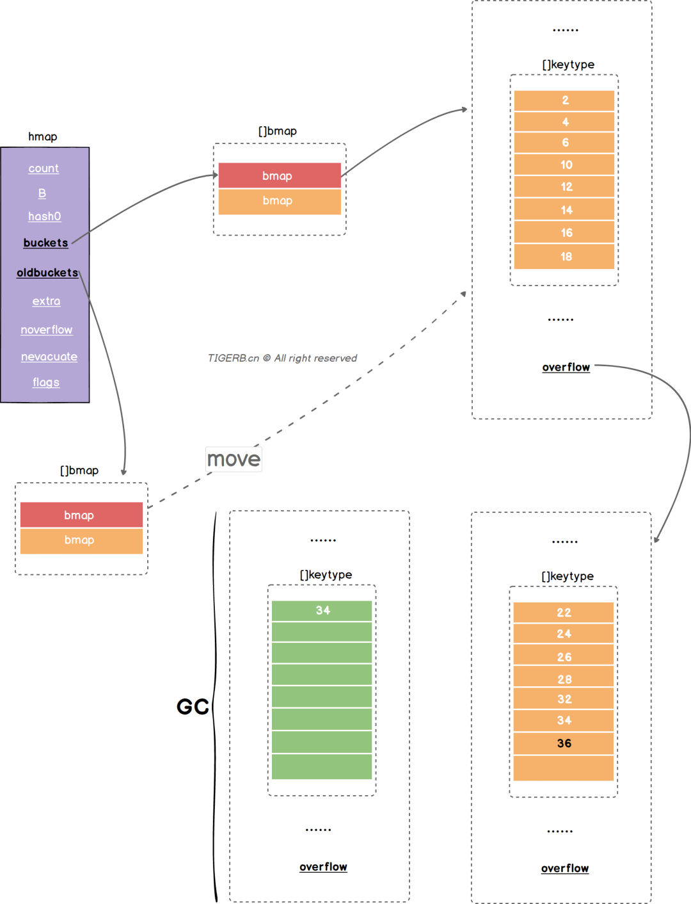


条件1. 否会触发「等量扩容」的公式：noverflow >= uint16(1)<<(B&15)
条件2. 上文我们已经假设：忽略索引为1的的`bucket`(也就是`buckets`的第2个`bmap`)，仅以索引为0的`bucket`(也就是`buckets`的第1个`bmap`)里的键值为例

可得：noverflow = 2
B = 1

我们套入这个公式：2 >= 1 << (0001 & 1111)
2 >= 1 << 0001
2 >= 0010
2 >= 2

得到结果：true

### Map读写问题

读取一个key的过程大致如下:
1. key通过hash函数得到key的hash
2. Key的hash通过取模或者位操作得到key在数组上的索引【golang: 哈希和数组的长度通过位操作获取数组位置的索引】
3. 通过索引找到对应的链表
4. 遍历链表对比key和目标key 相等则返回value

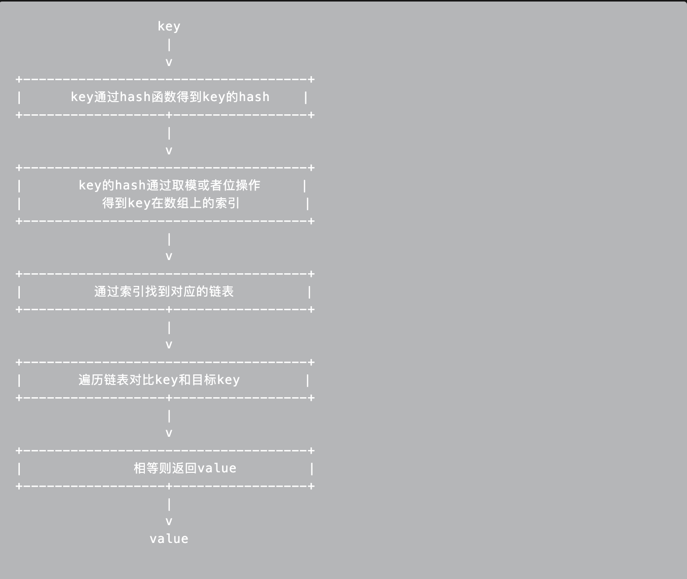
Go语言解决hash冲突不是链表 是记住要用的数组(内存上的连续空间) 并且不是使用一个数组 而是使用两个数组分别存储键和值
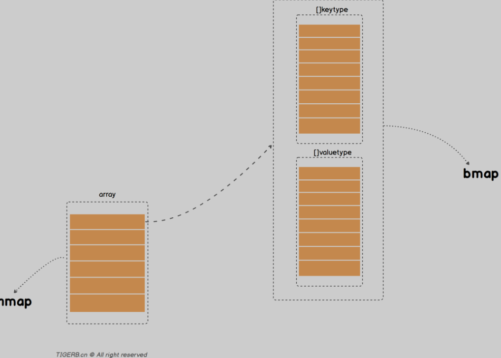
分别对应的是两个核心的结构体 hmap和bmap bmap里面两个数组 分别存放key和value
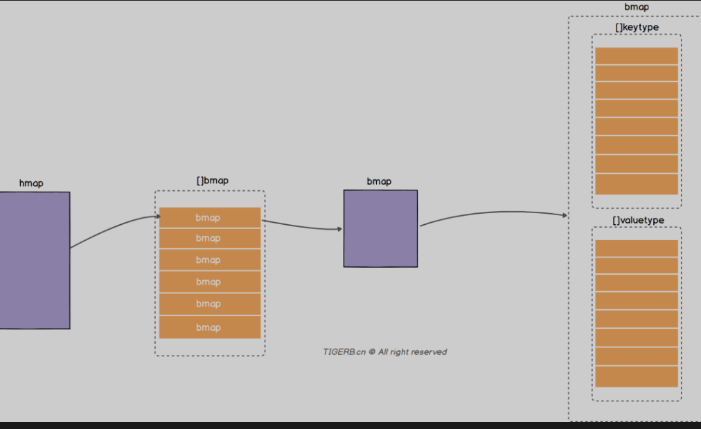
Hmap的结构 ：

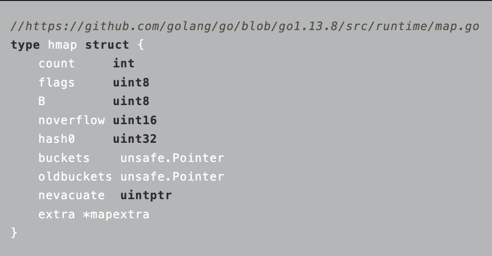
count: 键值对的数量, 
B： 2^B=len(busckets)
Hash0: hash因子
Buckets: 指向一个数组(连续内存空间), 数组的类型是[]bmap 就是正常桶
oldbuckets: 扩容的时候存放之前的buckets
Extra:溢出桶结构 正常桶里面bmap存满了 会使用这里的内存空间存储空间存放键值对 
noverflow:溢出桶里面的bmap的大致的数量
nevacuate：分流次数 成倍扩容分流操作计数的字段(map扩容相关字段)
Flags: 状态标识 正在被写 正在遍历 等量扩容等


Bmap的结构:

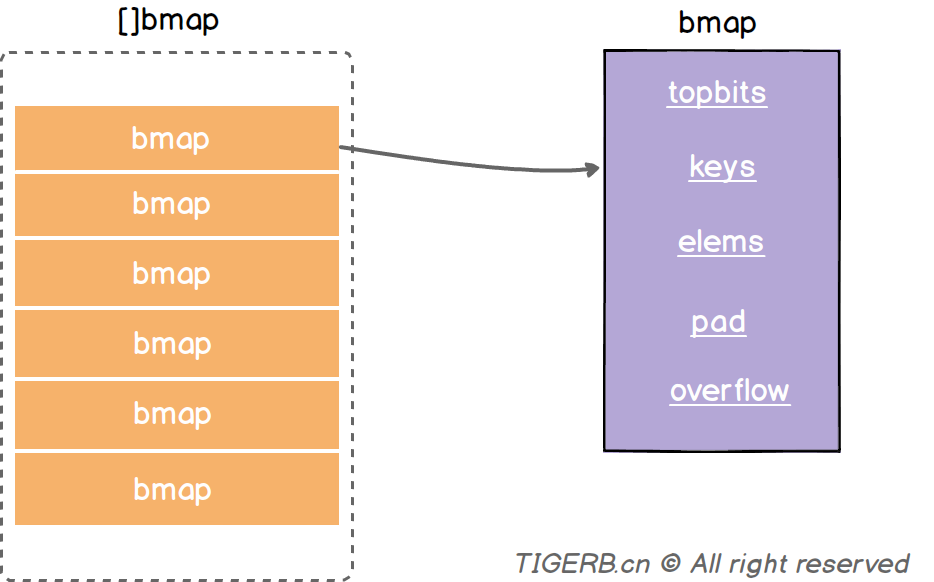


Topbits: 长度为8的数组 []uint8 元素为: key获取的hash的高8位 遍历对比的时候使用 
Keys：长度为8的数组 []keybyte 具体的key值
Elems： 长度为8的数组 []elemtype 原属为键值对的key对应的值 
overflow: 指向的hmap.extra.overflow 的bmap 上面的最多村8个 满了就指向这个bmap 存放的就是正常桶满了之后关联的溢出桶bmap地址 当map写操作的时候
Pad: 对其内存使用的 不是每个bmap都有 需要满足条件 
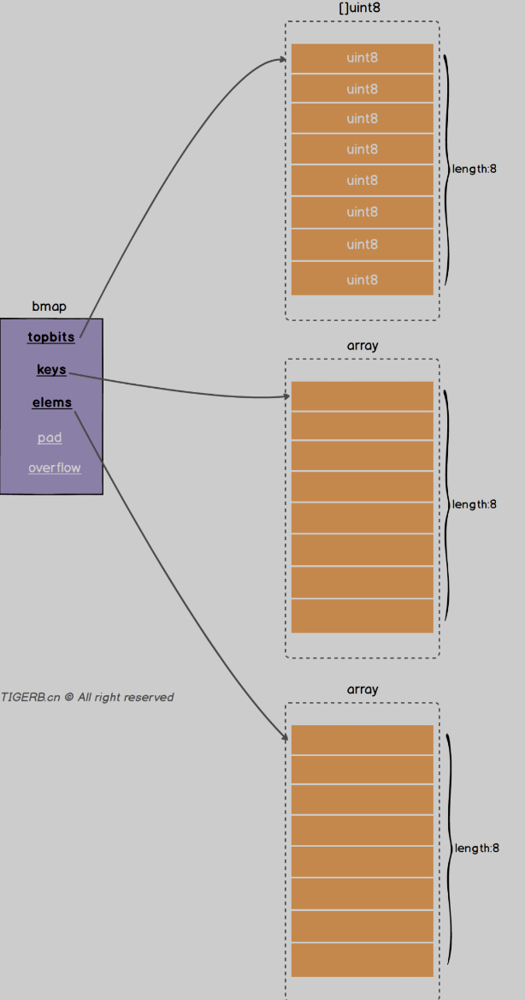

每个bmap最多存放8组键值对 
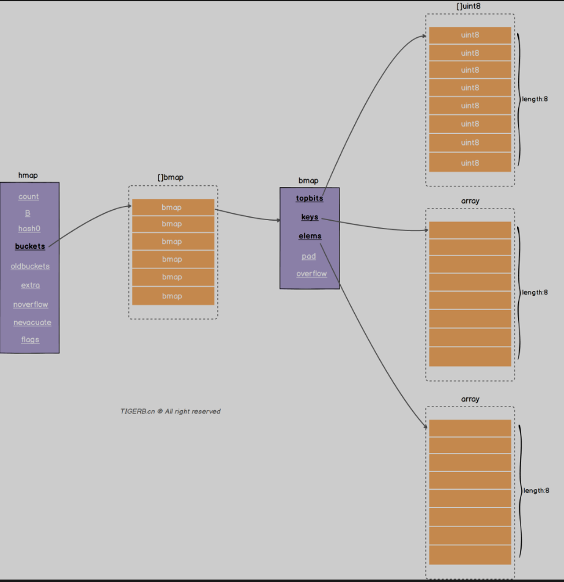
正常桶Bmap满了之后的操作:
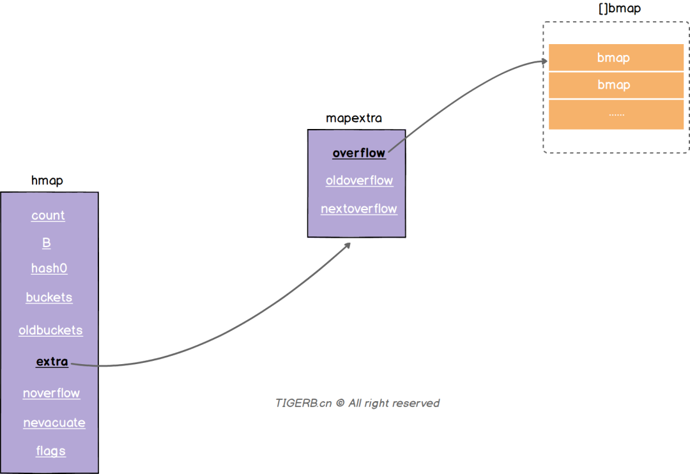
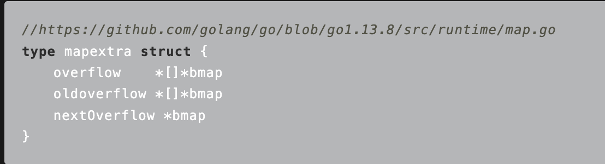
Overflow: 溢出桶 和hmap.buckets一样也是数组 []bmap 当正常桶满了之后就是用map.extra.overflow的bmap 
oldoverflow ： 扩容时存放之前的overflow 
nextoverflow: 指向溢出桶下一个可以使用的bmap


Map写操作关键代码：

```
// https://github.com/golang/go/blob/go1.13.8/src/runtime/map.go
func mapassign(t *maptype, h *hmap, key unsafe.Pointer) unsafe.Pointer {
  // 略
again:
	// 略...
	var inserti *uint8
  // 略...
bucketloop:
	for {
		for i := uintptr(0); i < bucketCnt; i++ {
      // key的hash高8位不相等
			if b.tophash[i] != top {
        // 当前位置bmap.tophash的元素为空且还没有写入的记录(inserti已经写入的标记为)
				if isEmpty(b.tophash[i]) && inserti == nil {
          // inserti赋值为当前的hash高8位 标记写入成功
					inserti = &b.tophash[i]
					// 略...
				}
				// 略...
				continue
			}
			// 略...
			goto done
    }
    // 正常桶的bmap遍历完了 继续遍历溢出桶的bmap 如果有的话
		ovf := b.overflow(t)
		if ovf == nil {
			break
    }
		b = ovf
	}

  // 略...

  // 没写入成功(包含正常桶的bmap、溢出桶的bmap(如果有的话))
	if inserti == nil {
    // 分配新的bmap写
    newb := h.newoverflow(t, b)
    // 略...
	}

	// 略...
}

// 继续看h.newoverflow的代码
func (h *hmap) newoverflow(t *maptype, b *bmap) *bmap {
  var ovf *bmap
  // 如果hmap的存在溢出桶 且 溢出桶还没用完
	if h.extra != nil && h.extra.nextOverflow != nil {
    // 使用溢出桶的bmap
    ovf = h.extra.nextOverflow
    // 判断桶的bmap的overflow是不是空
    // 这里很巧妙。为啥？
    // 溢出桶初始化的时候会把最后一个bmap的overflow指向正常桶，值不为nil
    // 目的判断当前这个bmap是不是溢出桶里的最后一个
		if ovf.overflow(t) == nil {
      // 是nil
      // 说明不是最后一个
			h.extra.nextOverflow = (*bmap)(add(unsafe.Pointer(ovf), uintptr(t.bucketsize)))
		} else {
      // 不是nil
      // 则重置当前bmap的overflow为空
      ovf.setoverflow(t, nil)
      // 且 标记nextOverflow为nil 说明当前溢出桶用完了
			h.extra.nextOverflow = nil
		}
	} else {
    // 没有溢出桶 或者 溢出桶用完了
    // 内存空间重新分配一个bmap
		ovf = (*bmap)(newobject(t.bucket))
  }
  // 生成溢出桶bmap的计数器计数
	h.incrnoverflow()
  // 略...
  // 这行代码就是上面问题我们要的答案:
  // 正常桶`hmap.buckets`里的`bmap`在这里关联上溢出桶`hmap.extra.overflow`的`bmap`
	b.setoverflow(t, ovf)
	return ovf
}

// setoverflow函数的源码
func (b *bmap) setoverflow(t *maptype, ovf *bmap) {
  // 这行代码的意思：通过偏移量计算找到了bmap.overflow，并把ovf这个bmap的地址赋值给了bmap.overflow
	*(**bmap)(add(unsafe.Pointer(b), uintptr(t.bucketsize)-sys.PtrSize)) = ovf
}
```
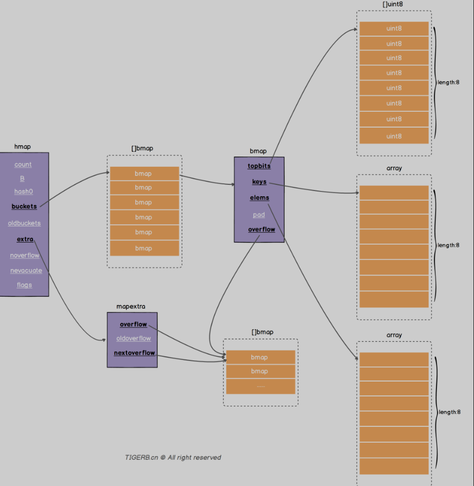

Hmap存在溢出桶 并且当前溢出桶仅仅使用了一个溢出桶的情况 
可以看见正常桶和溢出桶后称链表 

读取key的大致过程:
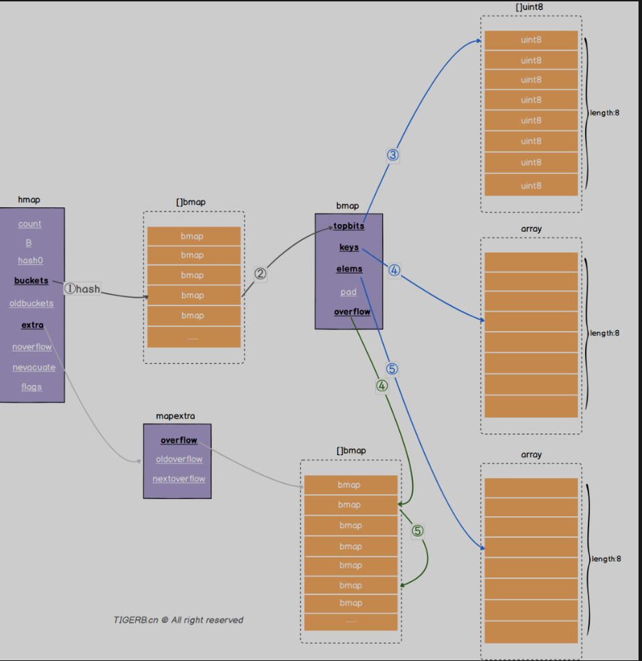


### Map Other

哈希表:

哈希查找表用一个哈希函数将key分配到不同的桶(bucket),这样子 开销主要在哈希函数的计算和数组的常数访问时间 哈希碰撞 用链表法 活着 开放地址法 ， 前者将bucket实现成一个链表 ，落在一个bucket中间的都插入这个链表 ，后者碰撞发生之后 通过一定的规律 在数组后面选择空的位置 放入新的key

自平衡搜索树法最差搜索效率是o(logN) 哈希表是O(N) ， 但是哈希表平均是 O(1),遍历自平衡搜索数 返回的key序列 按照从小到大 但是哈希是乱序的 

Map的结构体是hmap 就是hashmap的缩写 


