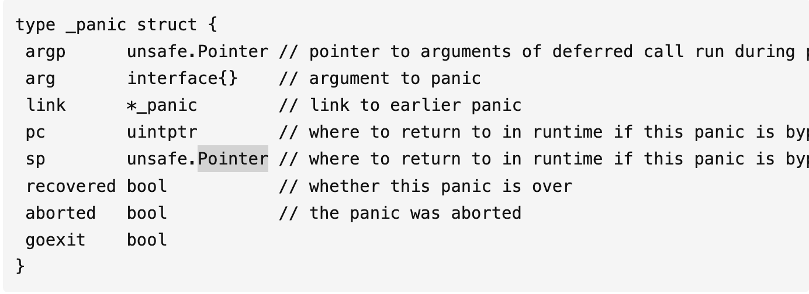

### Golang panic recover

Recover主要用于捕获异常 让程序回到正常状态  而且必须要在defer func()函数中间使用才可以 否则无法阻止panic
调用panic之后会立刻停止执行当前函数的剩余代码 并在当前goroutine中递归执行调用方的defer

调用runtime.deferprocStack创建defer对象 总共有三种模式:

第一种，堆上分配(deferproc)，基本是依赖运行时来分配"_defer"对象并加入延迟参数。在函数的尾部插入deferreturn方法来消费deferlink
第二种，栈上分配(deferprocStack)，基本上跟堆差不多，只是分配方式改为在栈上分配，压入的函数调用栈存有_defer记录，编译器在ssa过程中会预留defer空间
第三种，开放编码模式(open coded)，不过是有条件的，默认open-coded最多支持8个defer，超过则取消。在构建ssa时如发现gcflags有N禁止优化的参数 或者 return数量 * defer数量超过了 15不适用open-coded模式。并不能处于循环中



Argp指向defer调用时参数的指针 
Arg时panic发生的时候调用传入的参数
Link指向的是更早调用的runtime._panic结构 也就是说panic可以呗连续调用 他们之间形成链表
recovered表示当前runtime._panic是否呗revover恢复
aborted表示当前panic是否被强行终止

runtime中间有一个Goexit方法 可以终止调用他的goroutine 其他goroutine不受影响 goexit也会在终止goroutine之前运行所有延迟调用函数 
Goexit不是一个panic 所有这些延迟函数中间的recover都是返回nil， 

结构中的pc、sp、goexit三个字段都是为了修复runtime.Goexit，这三个字段就是为了保证该函数的一定会生效，因为如果在defer中发生panic，那么goexit函数就会被取消，所以才有了这三个字段做保护

1. 在程序执行过程中如果遇到panic，那么会调用runtime.gopanic，然后取当前Goroutine的defer链表依次执行。
2. 在调用defer函数是如果有recover就会调用runtime.gorecover，在gorecover中会把runtime._panic中的recoved标记为true，这里只是标记的作用，恢复逻辑仍在runtime.panic中。
3. 在gopanic中会执行defer内联优化、程序恢复逻辑。在程序恢复逻辑中，会进行判断，如果是触发是runtime.Goexit，也会进行recovery。panic也会进行recovery，主要逻辑是runtime.gopanic会从runtime._defer结构体中取出程序计数器pc和栈指针sp并调用runtime.recovery函数恢复程序。runtime.recvoery函数中会根据传入的 pc 和 sp 在gogo中跳转回runtime.deferproc，如果返回值为1，就会调用runtime.deferreturn恢复正常流程。
4. 在gopanic执行完所有的_defer并且也没有遇到recover，那么就会执行runtime.fatalpanic终止程序，并返回错误码2.

