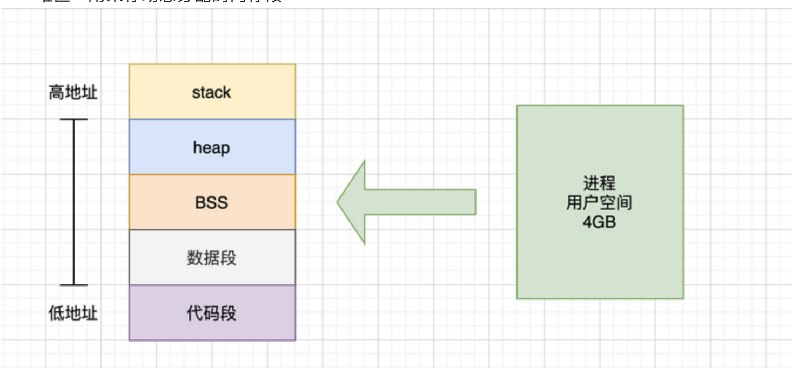
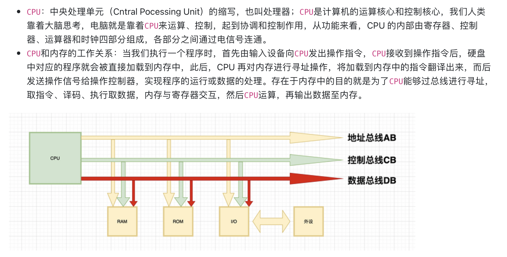
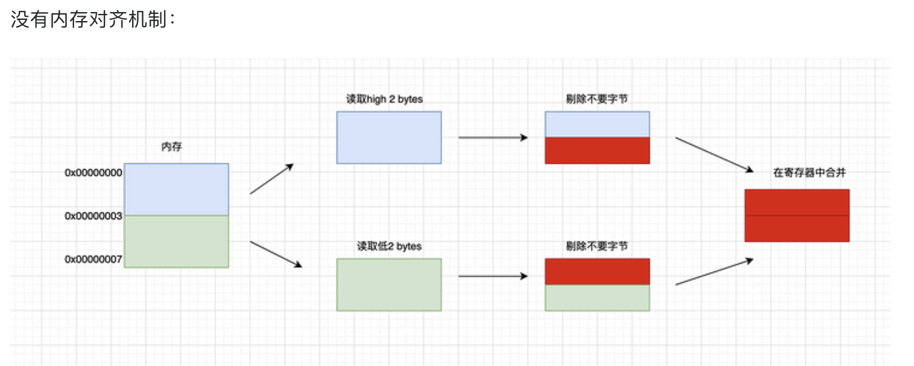
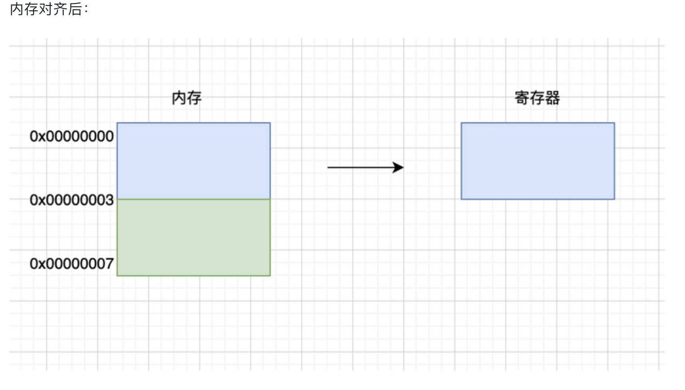
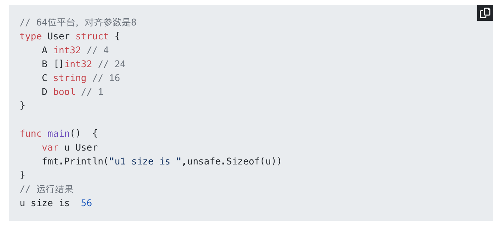

阅读博客 https://segmentfault.com/a/1190000040528007 记录

虚拟内存就是在程序和物理内存之间引入一个中间层 这个中间层就是虚拟内存  就实现了对进程地址和物理地址的隔离 

内存中间是划分为用户空间和内核空间的


用户空间分成了5个不同的内存区域 
1. 代码段 存放可执行文件的操作指令 只读
2. 数据段 用来存放可执行文件中间已经初始化的全局变量 存放静态变量和全局变量
3. BSS段 用来存放没有初始化的全局变量
4. 堆区 存放动态分配的内存段 
5. 栈区 用来存放临时创建的局部变量



编译器：编译器就是将“一种语言（通常为高级语言）”翻译为“另一种语言（通常为低级语言）”的程序。一个现代编译器的主要工作流程：源代码 (source code) → 预处理器(preprocessor) → 编译器 (compiler) → 目标代码 (object code) → 链接器 (Linker) → 可执行程序(executables)。

内存对齐是指首地址对齐 而不是说每个变量大小对齐 需要内存对齐的原因:
1. 有些CPU可以访问任意位置数据 但是有些只能访问特定位置数据
2. CPU每次寻址都是耗费时间的 CPU访问内存的时候不是逐个字节访问的 而是按照字长 访问 所以尽可能在自然边界上对齐 如果没有对齐 处理器需要访问两次内存 



一般来说 32位操作系统默认对其系数是4 64位的操作系统是8  当然这个是默认的  有些事可以修改的 比如C语言 通过预编译指令。#pragram pack(n) 可以修改这个对齐系数 但是GO语言没有这个 主要是我没找到

GO语言可以通过unsafe.Alignof获得相应的对齐系数 对齐系数都符合2^n这个规律，最大也不会超过8。

C语言的对齐规则和Go基本都是一样的 不知道新的版本会不会变化 
1. 对于结构体的各个成员 第一个成员位于偏移量为0的位置 结构体的第一个成员的offset为0 以后每个成员相对于结构体首地址的offset都是这个成员大小和有效对齐值中间较小的那个整数倍 如果需要编译器会在成员之间填充字节
2. 除了结构体成员需要对齐 结构本身也需要对齐 结构的长度必须是编译器默认的对齐长度和成员中最长类型中最小的数据大小的倍数对齐 


 就上面这个 64位的机器  对齐参数是8  那么ABCD的对齐值分别是 4 8 8 1 占用内存分别是 4 24 16 1 

A int32类型 对齐值是4 大小是4 所以在第一位
B 对齐值是8 大小是 24 按照第一条规则 偏移量是这个成员的大小24和对齐值8中间较小的那个 那么偏移量就是8  也就是那个较小的整数倍  所以4-7会由编译器进行填充 一般是0值 也就是空洞 那么这个时候9到32位就是第二个字段8
C 对齐值也是8 大小为16  内存偏移也是要是8的倍数 因为之前到了 32 所以刚好是8的倍数 不需要填充 从32到48就是 c
D 对齐值是1 大小为1 所以内存偏移值要是1的倍数 48 是倍数 所以 48-49就是D

这是第一步的结构体内部字段对齐  现在占用49字节 然后按照第二规则进行结构体的对齐

默认是8 最大24 所以是8 目前长度是49 不是8的倍数 所以应该是56 那么补7位 就需要



