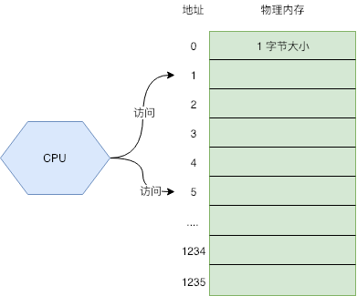
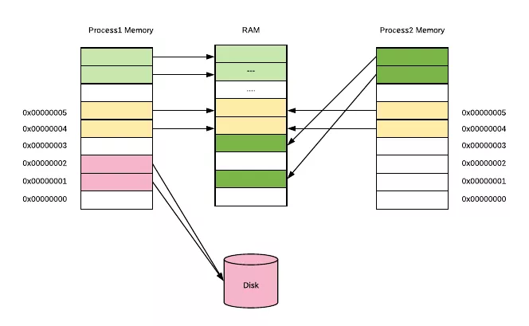
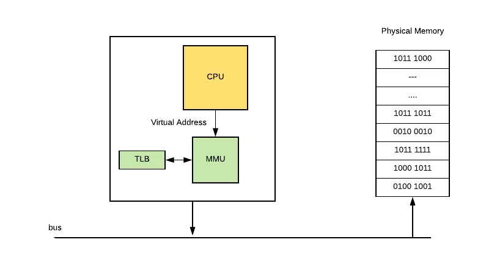
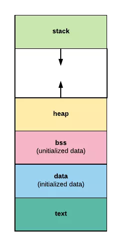

可以把内存看成一个数组，每个数组元素的大小是 1B，也就是 8 位(bit)。CPU 通过内存地址来获取内存中的数据，内存地址可以看做成数组的游标（index）



CPU 在执行指令的时候，就是通过内存地址，将物理内存上的数据载入到寄存器，然后执行机器指令,但随着发展，出现了多任务的需求，也就是希望多个任务能同时在系统上运行。这就出现了一些问题:
内存访问冲突：程序很容易出现 bug，就是 2 或更多的程序使用了同一块内存空间，导致数据读写错乱，程序崩溃。更有一些黑客利用这个缺陷来制作病毒。
内存不够用：因为每个程序都需要自己单独使用的一块内存，内存的大小就成了任务数量的瓶颈。
程序开发成本高：你的程序要使用多少内存，内存地址是多少，这些都不能搞错，对于人来说，开发正确的程序很费脑子。

虚拟内存
虚拟内存的出现，很好的为了解决上述的一些列问题。用户程序只能使用虚拟的内存地址来获取数据，系统会将这个虚拟地址翻译成实际的物理地址
对于内存不够用的问题，虚拟内存本质上是将磁盘当成最终存储，而主存作为了一个 cache。程序可以从虚拟内存上申请很大的空间使用，比如 1G；但操作系统不会真的在物理内存上开辟 1G 的空间，它只是开辟了很小一块，比如 1M 给程序使用。这样程序在访问内存时，操作系统看访问的地址是否能转换成物理内存地址。能则正常访问，不能则再开辟。这使得内存得到了更高效的利用。
如下图所示，每个进程所使用的虚拟地址空间都是一样的，但他们的虚拟地址会被映射到主存上的不同区域，甚至映射到磁盘上（当内存不够用时）。



其实本质上很简单，就是操作系统将程序常用的数据放到内存里加速访问，不常用的数据放在磁盘上。这一切对用户程序来说完全是透明的，用户程序可以假装所有数据都在内存里，然后通过虚拟内存地址去访问数据。在这背后，操作系统会自动将数据在主存和磁盘之间进行交换。

虚拟地址翻译
虚拟内存的实现方式，大多数都是通过页表来实现的。操作系统虚拟内存空间分成一页一页的来管理，每页的大小为 4K（当然这是可以配置的，不同操作系统不一样）。磁盘和主内存之间的置换也是以页为单位来操作的。4K 算是通过实践折中出来的通用值，太小了会出现频繁的置换，太大了又浪费内存。

虚拟地址 -> 物理地址 的映射关系由页表（Page Table）记录，它其实就是一个数组，数组中每个元素叫做页表条目（Page Table Entry，简称 PTE），PTE 由一个有效位和 n 位地址字段构成，有效位标识这个虚拟地址是否分配了物理内存。

页表被操作系统放在物理内存的指定位置，CPU 上有个 Memory Management Unit（MMU） 单元，CPU 把虚拟地址给 MMU，MMU 去物理内存中查询页表，得到实际的物理地址。当然 MMU 不会每次都去查的，它自己也有一份缓存叫Translation Lookaside Buffer (TLB)，是为了加速地址翻译




让我们来看一下 CPU 内存访问的完整过程：
1. CPU 使用虚拟地址访问数据，比如执行了 MOV 指令加载数据到寄存器，把地址传递给 MMU。
2. MMU 生成 PTE 地址，并从主存（或自己的 Cache）中得到它。
3. 如果 MMU 根据 PTE 得到真实的物理地址，正常读取数据。流程到此结束。
4. 如果 PTE 信息表示没有关联的物理地址，MMU 则触发一个缺页异常。
5. 操作系统捕获到这个异常，开始执行异常处理程序。在物理内存上创建一页内存，并更新页表。
6. 缺页处理程序在物理内存中确定一个牺牲页，如果这个牺牲页上有数据，则把数据保存到磁盘上。
7. 缺页处理程序更新 PTE。
8. 缺页处理程序结束，再回去执行上一条指令（导致缺页异常的那个指令，也就是 MOV 指令）。这次肯定命中了

内存命中率：
命中率，这是衡量内存管理程序好坏的一个很重要的指标 在 n 次内存访问中，出现命中的次数是 m  那么 m / n * 100% 就表示命中率
如果物理内存不足了，数据会在主存和磁盘之间频繁交换，命中率很低，性能出现急剧下降，我们称这种现象叫内存颠簸。这时你会发现系统的 swap 空间利用率开始增高， CPU 利用率中 iowait 占比开始增高。
大多数情况下，只要物理内存够用，页命中率不会非常低，不会出现内存颠簸的情况。因为大多数程序都有一个特点，就是局部性

局部性就是说被引用过一次的存储器位置，很可能在后续再被引用多次；而且在该位置附近的其他位置，也很可能会在后续一段时间内被引用

CPU Cache
主存与存储器之间以 page（通常是 4K） 为单位进行交换，cache 与 主存之间是以 cache line（通常 64 byte） 为单位交换的。



程序内存布局



text 段：存储程序的二进制指令，及其他的一些静态内容
data 段：用来存储已被初始化的全局变量。比如常量（const）
bss 段：用来存放未被初始化的全局变量。和 .data 段一样都属于静态分配，在这里面的变量数据在编译就确定了大小，不释放。
heap 段：堆空间，用于动态分配，C 语言中 malloc 和 free 操作的内存就在这里；Go 语言主要靠 GC 自动管理这部分。
stack 段：栈空间，主要用于函数调用时存储临时变量的。这部分的内存是自动分配自动释放的。

栈空间是通过压栈出栈方式自动分配释放的，由系统管理，使用起来高效无感知。
堆空间是用以动态分配的，由程序自己管理分配和释放。Go 语言虽然可以帮我们自动管理分配和释放，但是代价也是很高的。

CPU Cache 层面的低命中率导致的是程序运行缓慢，内存层面的低命中率会出现内存颠簸，

1. 从全局存储区域分配: 这时内存再程序编译阶段就已经分配好 这个内存在程序运行的整个周期都有效 如:全局变量
2. 从栈区分配，在执行函数的时候 函数中的局部变量的存储单元可以从栈中间分配 函数执行结束之后这些存储单元都会被自动释放 实现从栈中间分配的存储单元运算操作内置于处理器的指令集中间 效率很高 但是分配的内存容量有限
3. 从堆中间分配 就是动态内存分配 程序运行期间 使用malloc和new申请人意数量的内存单元 有程序员决定啥时候free和delete释放内存

