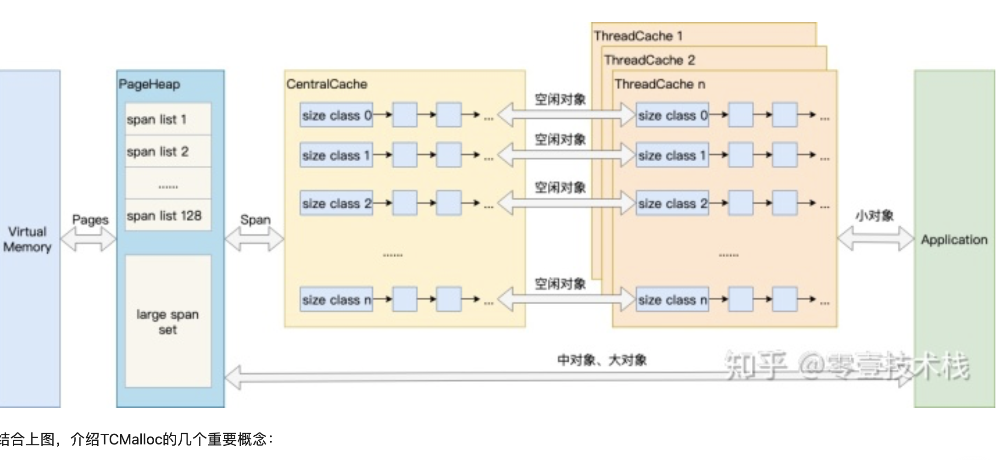
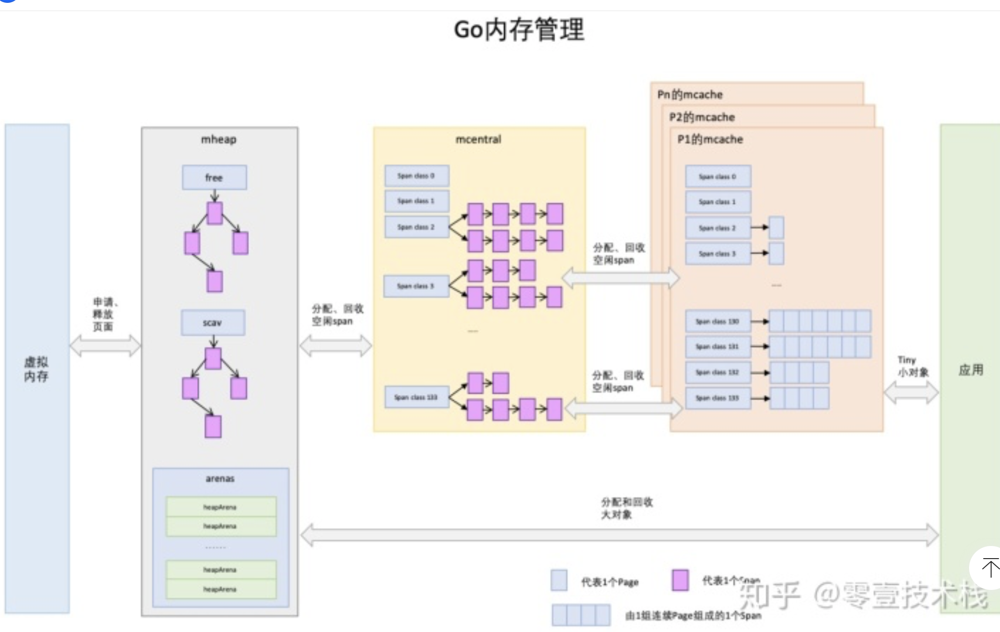
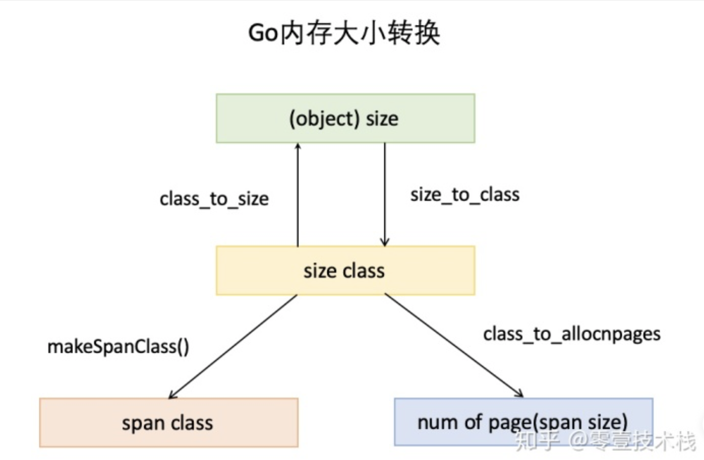
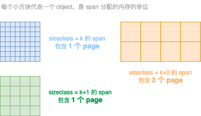
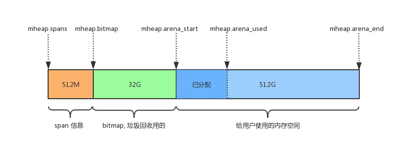
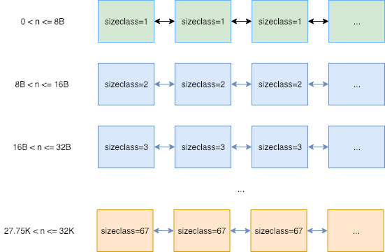
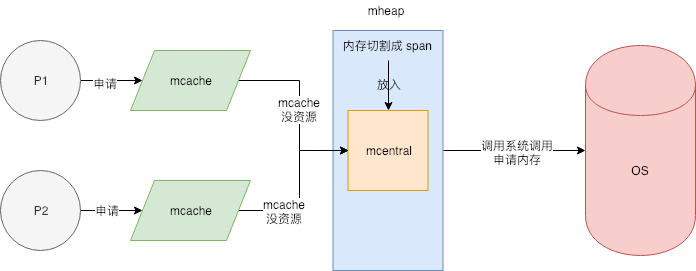
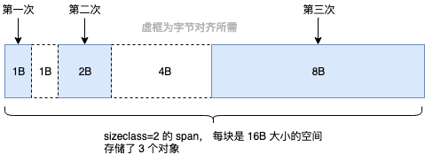
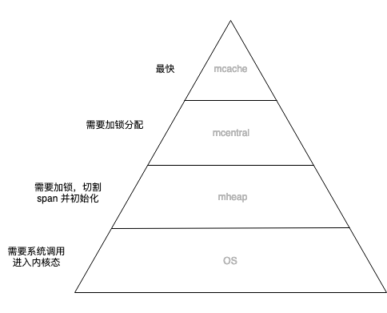
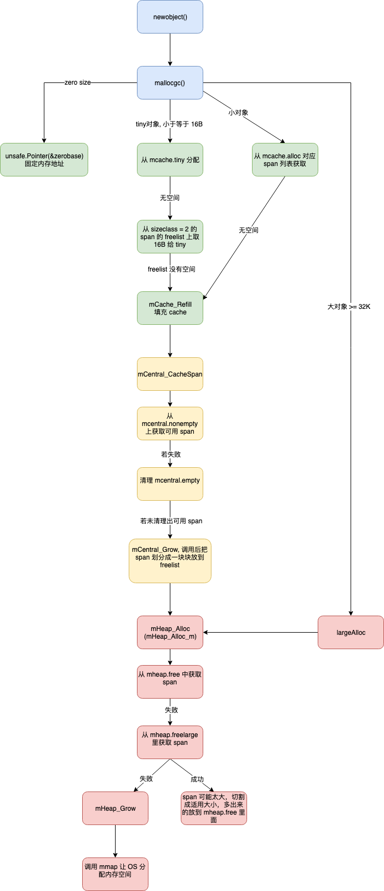

### Golang内存管理

Go 的内存管理基本上参考 tcmalloc 来实现的， Go 的内存是自动管理的，我们可以随意定义变量直接使用，不需要考虑变量背后的内存申请和释放的问题


TCMalloc:


GO:




mheap里保存了两棵二叉排序树，按span的page数量进行排序：
free：free中保存的span是空闲并且非垃圾回收的span。
scav：scav中保存的是空闲并且已经垃圾回收的span。
如果是垃圾回收导致的span释放，span会被加入到scav，否则加入到free，比如刚从OS申请的的内存也组成的Span。


mheap与PageHeap也有不同点：mheap把Span组织成了树结构，而不是链表，并且还是2棵树，然后把Span分配到heapArena进行管理，它包含地址映射和span是否包含指针等位图，这样做的主要原因是为了更高效的利用内存：分配、回收和再利用




object size：代码里简称size，指申请内存的对象大小。
size class：代码里简称class，它是size的级别，相当于把size归类到一定大小的区间段，比如size[1,8]属于size class 1，size(8,16]属于size class 2。
span class：指span的级别，但span class的大小与span的大小并没有正比关系。span class主要用来和size class做对应，1个size class对应2个span class，2个span class的span大小相同，只是功能不同，1个用来存放包含指针的对象，一个用来存放不包含指针的对象，不包含指针对象的Span就无需GC扫描了。
num of page：代码里简称npage，代表Page的数量，其实就是Span包含的页数，用来分配内存。



池
程序动态申请内存空间，是要使用系统调用的，比如 Linux 系统上是调用 mmap 方法实现的。但对于大型系统服务来说，直接调用 mmap 申请内存，会有一定的代价：
1. 系统调用会导致程序进入内核态，内核分配完内存后（也就是上篇所讲的，对虚拟地址和物理地址进行映射等操作），再返回到用户态。
2. 频繁申请很小的内存空间，容易出现大量内存碎片，增大操作系统整理碎片的压力。
3. 为了保证内存访问具有良好的局部性，开发者需要投入大量的精力去做优化，这是一个很重的负担

对象池：
1. 不需要频繁申请内存了，而是从对象池里拿，程序不会频繁进入内核态
2. 因为一次性申请一个连续的大空间，对象池会被重复利用，不会出现碎片。
3. 程序频繁访问的就是对象池背后的同一块内存空间，局部性良好。

这样做会造成一定的内存浪费，我们可以定时检测对象池的大小，保证可用对象的数量在一个合理的范围，少了就提前申请，多了就自动释放。
如果某种资源的申请和回收是昂贵的，我们都可以通过建立资源池的方式来解决，其他比如连接池，内存池等等，都是一个思路

Golang 内存管理
Golang 的内存管理本质上就是一个内存池，只不过内部做了很多的优化。比如自动伸缩内存池大小，合理的切割内存块等等。


内存池 mheap
Golang 的程序在启动之初，会一次性从操作系统那里申请一大块内存作为内存池。这块内存空间会放在一个叫 mheap 的 struct 中管理，mheap 负责将这一整块内存切割成不同的区域，并将其中一部分的内存切割成合适的大小，分配给用户使用。


page: 内存页，一块 8K 大小的内存空间。Go 与操作系统之间的内存申请和释放，都是以 page 为单位的。
span: 内存块，一个或多个连续的 page 组成一个 span。
sizeclass: 空间规格，每个 span 都带有一个 sizeclass，标记着该 span 中的 page 应该如何使用
object: 对象，用来存储一个变量数据内存空间，一个 span 在初始化时，会被切割成一堆等大的 object。假设 object 的大小是 16B，span 大小是 8K，那么就会把 span 中的 page 就会被初始化 8K / 16B = 512 个 object。所谓内存分配，就是分配一个 object 出去。

Page---span—




不同span的sizeclass不同 那么里面的page就会按照不同的规格切割成等大的object用作分配
Go1.17.2 测试初始堆内存大约是 3866624byte [字节 1byte=8bit 1byte=1B 1KB=1024B 1MB=1024KB]  就是3776KB


内部的整体内存布局如下图所示



图中的空间大小，是 Go 向操作系统申请的虚拟内存地址空间，操作系统会将该段地址空间预留出来不做它用；而不是真的创建出这么大的虚拟内存，在页表中创建出这么大的映射关系

mheap.spans：用来存储 page 和 span 信息，比如一个 span 的起始地址是多少，有几个 page，已使用了多大等等。
mheap.bitmap 存储着各个 span 中对象object的标记信息，比如对象是否可回收等等。
mheap.arena_start: 将要分配给应用程序使用的空间。


mcentral
用途相同的span将会以链表的形式组织在一起 这里的用途用sizeclass来表示 就是指这个span用来存储哪种大小的对象 ，sizeclass 1.5版本共67种 



找到合适的span之后 会从中取出一个object返回给上层使用 这些span被放在一个叫做mcentral的结构中间管理 
Mheap会将从os那里申请过来的内存初始化成一个大的Span(sizeclass=0) 然后根据需要从这个大的span切分出小的span 放在mcentral中间管理 大的span由mheap.freelarge和mheap.busylarge来管理 如果mcentral中间span不够了 就从mheap.freelarge拿 这里不够就再从os申请内存 

type mheap struct {
    lock      mutex
    free      [_MaxMHeapList]mspan // free lists of given length， 1M 以下
    freelarge mspan                // free lists length >= _MaxMHeapList, >= 1M
    busy      [_MaxMHeapList]mspan // busy lists of large objects of given length
    busylarge mspan                // busy lists of large objects length >= _MaxMHeapList

    central [_NumSizeClasses]struct {     // _NumSizeClasses = 67
        mcentral mcentral
    }
  
}


type mcentral struct {
    lock      mutex // 分配时需要加锁 避免并发情况下 多个协程同时申请内存 导致的冲突  但是 这个也会使得内存申请成为整个系统的瓶颈
    sizeclass int32 // 哪种 sizeclass
    nonempty  mspan // 还有可用的空间的 span 链表
    empty     mspan // 没有可用的空间的 span 列表
}

这种方式可以避免出现外部碎片（文章最后面有外部碎片的介绍），因为同一个 span 是按照固定大小分配和回收的，不会出现不可利用的一小块内存把内存分割掉。这个设计方式与现代操作系统中的伙伴系统有点类似。

 mcache

mcentral中间的锁会成为系统瓶颈。所以mcentral的前面又增加了一层mcache ，每一个mcache和每一个处理器(P) 对应  也就是说每一个P 都有一个mcache成员 goroutine申请内存的时候 首先从p所有的mcache中间分配 如果mcache中间没有可用的span 再从mcentral中间获取 并且填充到mcache中间 从mcache上分配内存是不需要加锁的 因为同一时间 一个p只有一个协程在上面运行 不可能出现竞争 没有锁的限制 加速了内存分配 

所以整体的内存分配模型大致如下图所示：





其他优化：
有一些对象所需要的内存大小是0 如struct{} 这种类型的数据不需要内存 所以不会走上面的逻辑 系统会返回一个固定的地址  0x1180f88

Tiny对象：就是微小对象
上面提到的 sizeclass=1 的 span，用来给 <= 8B 的对象使用，所以像 int32, byte, bool 以及小字符串等常用的微小对象，都会使用 sizeclass=1 的 span，但分配给他们 8B 的空间，大部分是用不上的。并且这些类型使用频率非常高，就会导致出现大量的内部碎片。
所以 Go 尽量不使用 sizeclass=1 的 span， 而是将 < 16B 的对象为统一视为 tiny 对象(tinysize)。分配时，从 sizeclass=2 的 span 中获取一个 16B 的 object 用以分配。如果存储的对象小于 16B，这个空间会被暂时保存起来 (mcache.tiny 字段)，下次分配时会复用这个空间，直到这个 object 用完为止




如果要存储的数据里有指针，即使 <= 8B 也不会作为 tiny 对象对待，而是正常使用 sizeclass=1 的 span。


大对象:
最大的 sizeclass 最大只能存放 32K 的对象。如果一次性申请超过 32K 的内存，系统会直接绕过 mcache 和 mcentral，直接从 mheap 上获取，mheap 中有一个 freelarge 字段管理着超大 span。


内存释放:
内存释放的过程就是分配的反过程 当mcache存在很多的空闲span的时候就会归还给mcentral mcentral存在很多空闲span就会归还给mheap
Mheap再归还给系统 

1. 内存分配主要在用户态完成 不需要频繁进入内核态
2. 每个p都有独立的span cache 多个cpu不会并发读写同一块内存 减少cpu L1 cache的cacheline出现dirty的情况 增加cpu cache命中率
3. 内存碎片问题 是自己在用户态管理的 在操作系统层是没有碎片的 使得操作系统堆碎片的管理塔里降低
4. Mcache的存在使得内存分配不需要加锁 增加了分配速度 

1. 代价就是需要预先申请大块内存 




将有限的计算机资源布局呈金字塔结构 再将数据从热到冷分为几个层级 放置在金字塔结构上 调度器不断调整 将热数据放在顶层 冷数据放在塔底层 

这种设计利用了计算的局部性特征，认为冷热数据的交替是缓慢的。所以最怕的就是，数据访问出现冷热骤变。在操作系统上我们称这种现象为内存颠簸，系统架构上通常被说成是缓存穿透。其实都是一个意思，就是过度的使用了金字塔低端的资源。


内存碎片：
内存碎片是系统在内存管理过程中，会不可避免的出现一块块无法被使用的内存空间，这是内存管理的产物。

内部碎片：
一般都是因为字节对齐，如上面介绍 Tiny 对象分配的部分；为了字节对齐，会导致一部分内存空间直接被放弃掉，不做分配使用。
再比如申请 28B 大小的内存空间，系统会分配 32B 的空间给它，这也导致了其中 4B 空间是被浪费掉的。这就是内部碎片

外部碎片：
一般是因为内存的不断分配释放，导致一些释放的小内存块分散在内存各处，无法被用以分配。




源代码调用流程图：



runtime.MemStats 部分注释

```text
type MemStats struct {
        // heap 分配出去的字节总数，和 HeapAlloc 值相同
        Alloc uint64

        // TotalAlloc 是 heap 累计分配出去字节数，每次分配
        // 都会累加这个值，但是释放时候不会减少
        TotalAlloc uint64

        // Sys 是指程序从 OS 那里一共申请了多少内存
        // 因为除了 heap，程序栈及其他内部结构都使用着从 OS 申请过来的内存
        Sys uint64

        // Mallocs heap 累积分配出去的对象数
        // 活动中的对象总数，即是 Mallocs - Frees
        Mallocs uint64
       
        // Frees 值 heap 累积释放掉的对象总数
        Frees uint64

        // HeapAlloc 是分配出去的堆对象总和大小，单位字节
        // object 的声明周期是 待分配 -> 分配使用 -> 待回收 -> 待分配
        // 只要不是待分配的状态，都会加到 HeapAlloc 中
        // 它和 HeapInuse 不同，HeapInuse 算的是使用中的 span，
        // 使用中的 span 里面可能还有很多 object 闲置
        HeapAlloc uint64

        // HeapSys 是 heap 从 OS 那里申请来的堆内存大小，单位字节
        // 指的是虚拟内存的大小，不是物理内存，物理内存大小 Go 语言层面是看不到的。
        // 等于 HeapIdle + HeapInuse
        HeapSys uint64

        // HeapIdle 表示所有 span 中还有多少内存是没使用的
        // 这些 span 上面没有 object，也就是完全闲置的，可以随时归还给 OS
        // 也可以用于堆栈分配
        HeapIdle uint64

        // HeapInuse 是处在使用中的所有 span 中的总字节数
        // 只要一个 span 中有至少一个对象，那么就表示它被使用了
        // HeapInuse - HeapAlloc 就表示已经被切割成固定 sizeclass 的 span 里
        HeapInuse uint64

        // HeapReleased 是返回给操作系统的物理内存总数
        HeapReleased uint64

        // HeapObjects 是分配出去的对象总数
        // 如同 HeapAlloc 一样，分配时增加，被清理或被释放时减少
        HeapObjects uint64

        // NextGC is the target heap size of the next GC cycle.
        // NextGC 表示当 HeapAlloc 增长到这个值时，会执行一次 GC
        // 垃圾回收的目标是保持 HeapAlloc ≤ NextGC，每次 GC 结束
        // 下次 GC 的目标，是根据当前可达数据和 GOGC 参数计算得来的
        NextGC uint64

        // LastGC 是最近一次垃圾回收结束的时间 (the UNIX epoch).
        LastGC uint64

        // PauseTotalNs 是自程序启动起， GC 造成 STW 暂停的累积纳秒值
        // STW 期间，所有的 goroutine 都会被暂停，只有 GC 的 goroutine 可以运行
        PauseTotalNs uint64

        // PauseNs 是循环队列，记录着 GC 引起的 STW 总时间
        //
        // 一次 GC 循环，可能会出现多次暂停，这里每项记录的是一次 GC 循环里多次暂停的综合。
        // 最近一次 GC 的数据所在的位置是 PauseNs[NumGC%256]
        PauseNs [256]uint64

        // PauseEnd 是一个循环队列，记录着最近 256 次 GC 结束的时间戳，单位是纳秒。
        //
        // 它和 PauseNs 的存储方式一样。一次 GC 可能会引发多次暂停，这里只记录一次 GC 最后一次暂停的时间
        PauseEnd [256]uint64

        // NumGC 指完成 GC 的次数
        NumGC uint32

        // NumForcedGC 是指应用调用了 runtime.GC() 进行强制 GC 的次数
        NumForcedGC uint32

        // BySize 统计各个 sizeclass 分配和释放的对象的个数
        //
        // BySize[N] 统计的是对象大小 S，满足 BySize[N-1].Size < S ≤ BySize[N].Size 的对象
        // 这里不记录大于 BySize[60].Size 的对象分配
        BySize [61]struct {
                // Size 表示该 sizeclass 的每个对象的空间大小
                // size class.
                Size uint32

                // Mallocs 是该 sizeclass 分配出去的对象的累积总数
                // Size * Mallocs 就是累积分配出去的字节总数
                // Mallocs - Frees 就是当前正在使用中的对象总数
                Mallocs uint64

                // Frees 是该 sizeclass 累积释放对象总数
                Frees uint64
        }
}
```


