### Golang 内存管理(三) 垃圾回收

Golang gc发展进程

1.1 版本: 标记+清除方式，整个过程需要 STW(stop the world，挂起所有用户 goroutine)
1.3 版本: 标记过程 STW，清除过程并行
1.5 版本: 标记过程使用三色标记法
1.8 版本: Hibrid Write Barrier

标记清除

垃圾回收的算法很多，比如最常见的引用计数，节点复制等等。Go 采用的是标记清除方式。当 GC 开始时，从 root 开始一层层扫描，这里的 root 区值当前所有 goroutine 的栈和全局数据区的变量(主要是这 2 个地方)。扫描过程中把能被触达的 object 标记出来，那么堆空间未被标记的 object 就是垃圾了；最后遍历堆空间所有 object 对垃圾（未标记）的 object 进行清除，清除完成则表示 GC 完成。清除的 object 会被放回到 mcache 中以备后续分配使用

Go 的内存mheap区域中有一个 bitmap 区域，就是用来存储 object 标记的 

最开始 Go 的整个 GC 过程需要 STW，因为用户进程如果在 GC 过程中修改了变量的引用关系，可能会导致清理错误

并行清除

这个优化很简单，如上面所述，STW 是为了阻止标记的错误，那么只需对标记过程进行 STW，确保标记正确。清除过程是不需要 STW 的。
标记清除算法致命的缺点就在 STW 上，所以 Golang 后期的很多优化都是针对 STW 的，尽可能缩短它的时间，避免出现 Go 服务的卡顿。

三色标记法
为了能让标记过程也能并行，Go 采用了三色标记 + 写屏障的机制。它的步骤大致如下
1. GC 开始时，认为所有 object 都是白色，即垃圾。
2. 从 root 区开始遍历，被触达的 object 置成灰色。
3. 遍历所有灰色 object，将他们内部的引用变量置成 灰色，自身置成 黑色
4. 循环第 3 步，直到没有灰色 object 了，只剩下了黑白两种，白色的都是垃圾。
5. 对于黑色 object，如果在标记期间发生了写操作，写屏障会在真正赋值前将新对象标记为灰色。
6. 标记过程中，mallocgc 新分配的 object，会先被标记成黑色再返回。

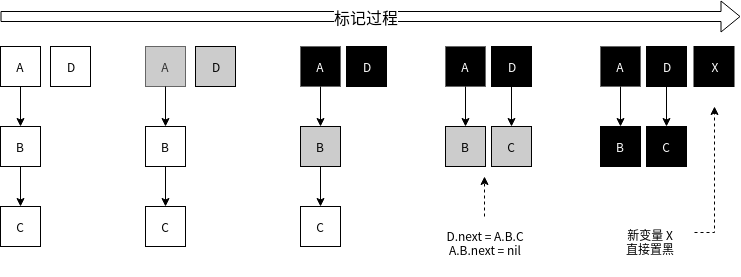

还有一种情况，标记过程中，堆上的 object 被赋值给了一个栈上指针，导致这个 object 没有被标记到。因为对栈上指针进行写入，写屏障是检测不到的。

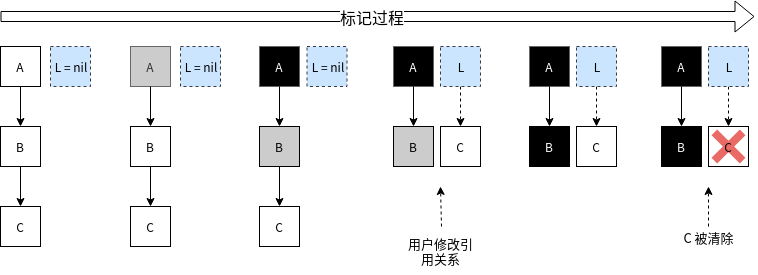

为了解决这个问题，标记的最后阶段，还会回头重新扫描一下所有的栈空间，确保没有遗漏。而这个过程就需要启动 STW 了，否则并发场景会使上述场景反复重现

整个 GC 流程如下图所示：

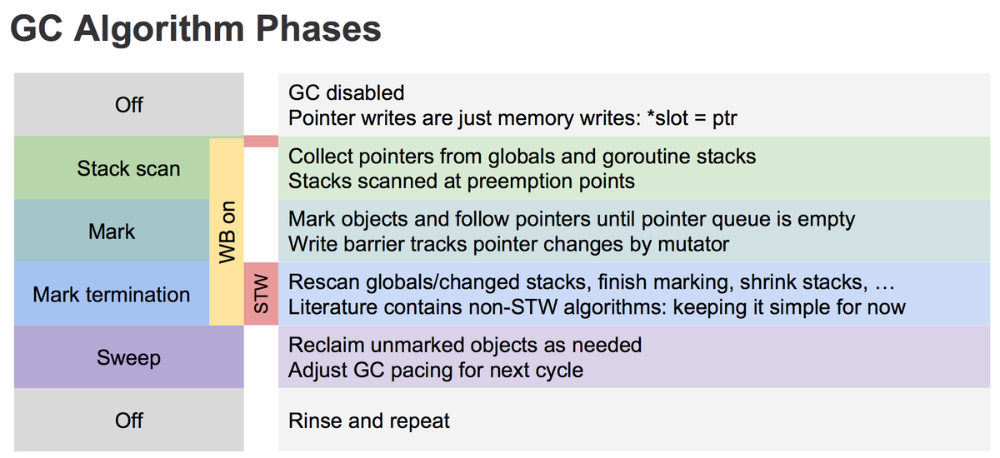

正常情况下，写操作就是正常的赋值。
GC 开始，开启写屏障等准备工作。开启写屏障等准备工作需要短暂的 STW。
Stack scan 阶段，从全局空间和 goroutine 栈空间上收集变量。
Mark 阶段，执行上述的三色标记法，直到没有灰色对象。
Mark termination 阶段，开启 STW，回头重新扫描 root 区域新变量，对他们进行标记。
Sweep 阶段，关闭 STW 和 写屏障，对白色对象进行清除。

Hibrid Write Barrier：

三色标记方式，需要在最后重新扫描一下所有全局变量和 goroutine 栈空间，如果系统的 goroutine 很多，这个阶段耗时也会比较长，甚至会长达 100ms。毕竟 Goroutine 很轻量，大型系统中，上百万的 Goroutine 也是常有的事儿。
上面说对栈上指针进行写入，写屏障是检测不到，实际上并不是做不到，而是代价非常高，Go 的写屏障故意没去管它，而是采取了再次扫描的方案
Go 在 1.8 版本引入了混合写屏障，其会在赋值前，对旧数据置灰，再视情况对新值进行置灰


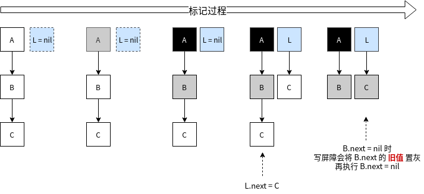

何时触发 GC
1. 一般是当 Heap 上的内存达到一定数值后，会触发一次 GC，这个数值我们可以通过环境变量 GOGC 或者 debug.SetGCPercent() 设置，默认是 100，表示当内存增长 100% 执行一次 GC。如果当前堆内存使用了 10MB，那么等到它涨到 20MB 的时候就会触发 GC。
2. 再就是每隔 2 分钟，如果期间内没有触发 GC，也会强制触发一次。
3. 最后就是用户手动触发了，也就是调用 runtime.GC() 强制触发一次

对于 tiny 对象，标记阶段是直接标记成黑色了，没有灰色阶段。因为 tiny 对象是不存放引用类型数据（指针）的，没必要标记成灰色再检查一遍。

### 其他博客的gc图解

经典的GC算法有三种 : 引用计数(reference counting) 标记-清扫(mark & sweep) 复制收集(copy and collection)

Golang主要基于 第二种 先是进行标记 然后清除 

1. 开始标记 程序暂停
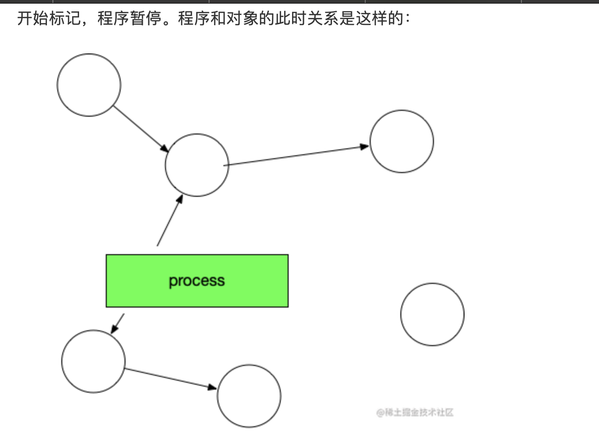
然后开始标记 process找出所有可达对象 并且加上标记
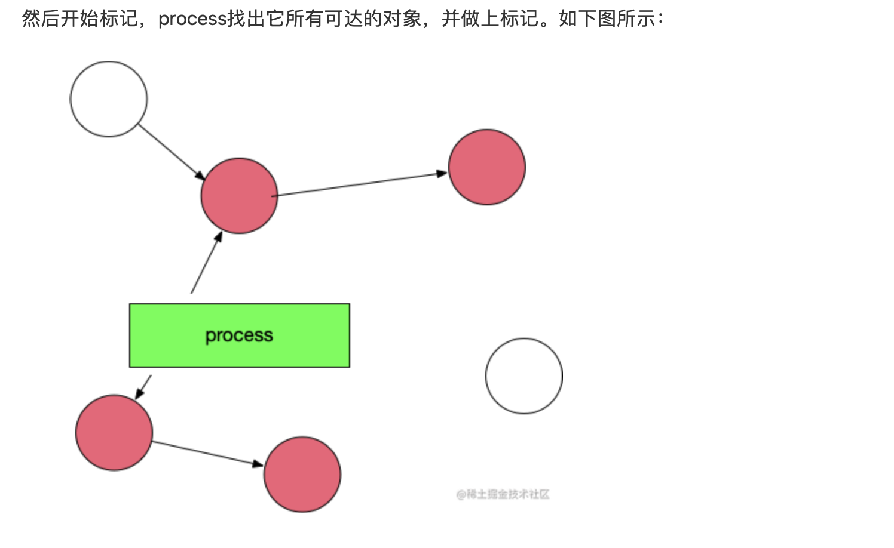
标记完成 清除没有标记的:
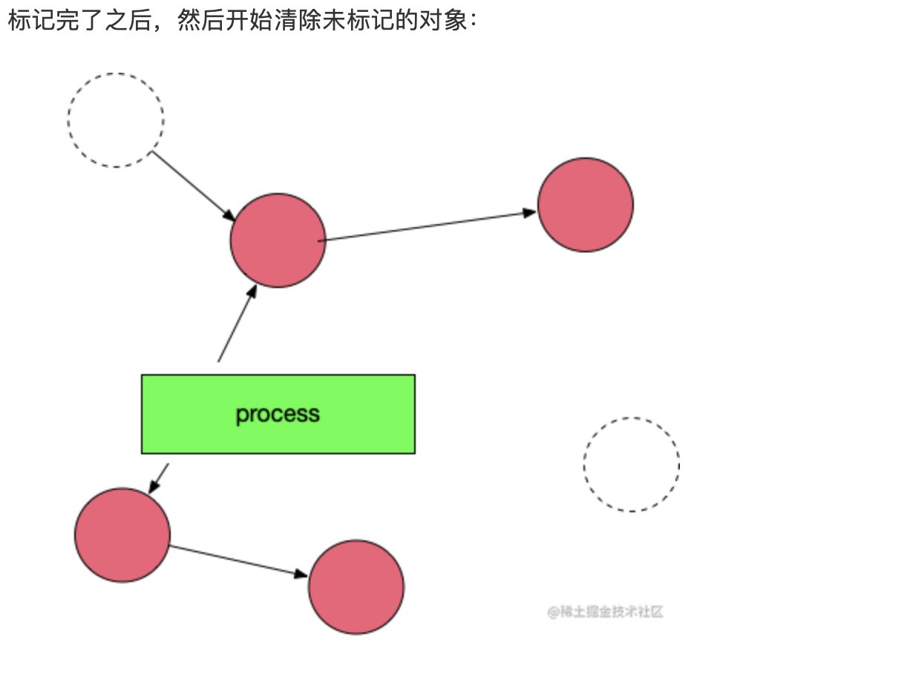
然后重新让程序跑起来

标记 清扫算法简单  但是存在一些问题 

1. 会暂停整个程序 卡顿
2. 标记需要扫描整个heap
3. 清除数据会产生heap碎片 

Golang三色标记算法:

1. 首先 程序创建的对象都标记为白色
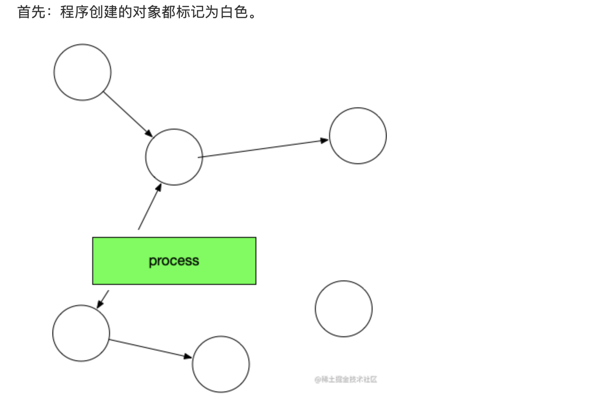
2. Gc开始 扫描所有的可到达的对象 标记为灰色
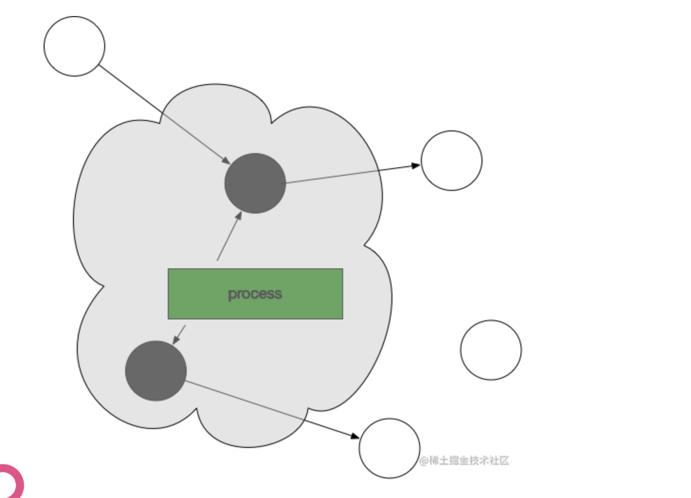
3. 从灰色对象中间找到其饮用对象标记为灰色 将灰色对象本身标记为黑色
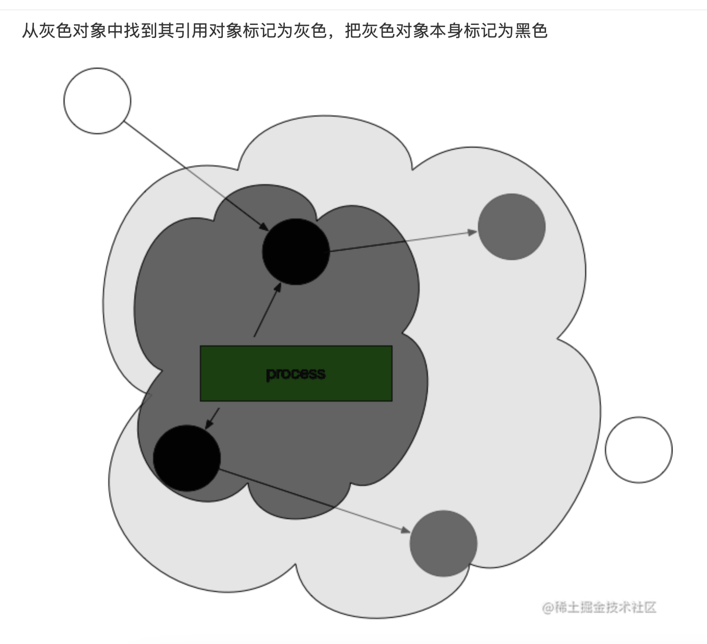
一直持续这个过程 直到灰色标记对象不存在 
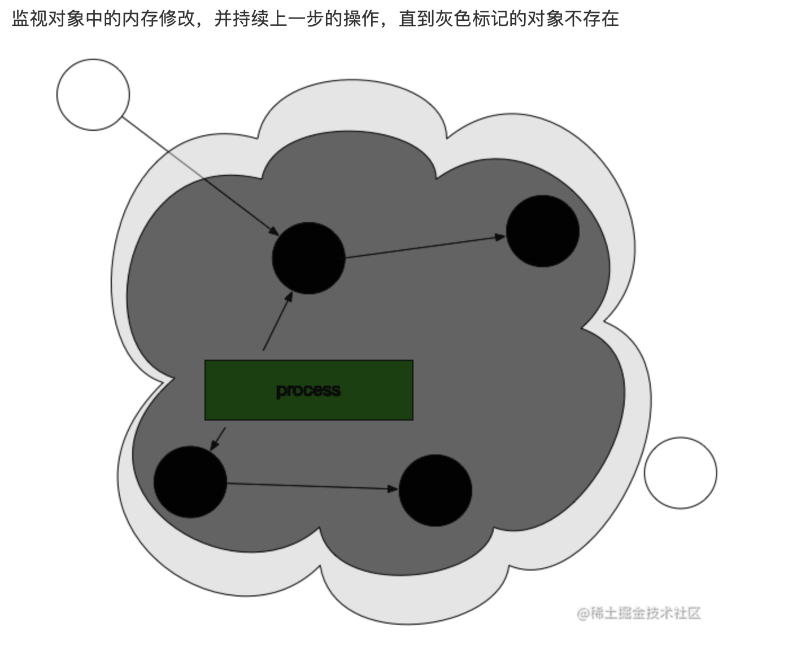
然后回收白色对象 然后将所有的黑色对象编程白色 并且不断重复 
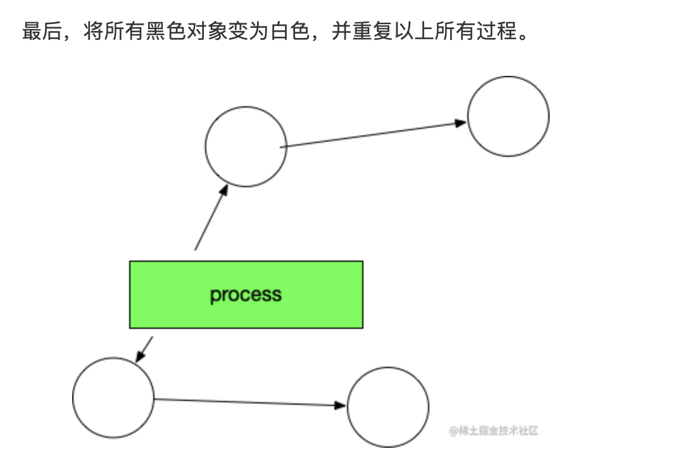
暂停的时候 就是runtime将所有的线程全部冻结 暂停用户逻辑操作  golang的三色标记因为清除的白色对象已经是不会用的 那么就可以和用户操作一起执行  但是新生成的对象在gc的时候依然可能呗干掉  所以加入了 写屏障机制  这个屏障之前的写操作和之后的写操作相比 先被系统其他组件感知 通俗的讲 就是在跑gc的过程中 可以监控对象的内存修改 并且对对象进行重新标记(十几还是超级短暂的stw 然后标记) 将新生成的对象一律设置为灰色 

