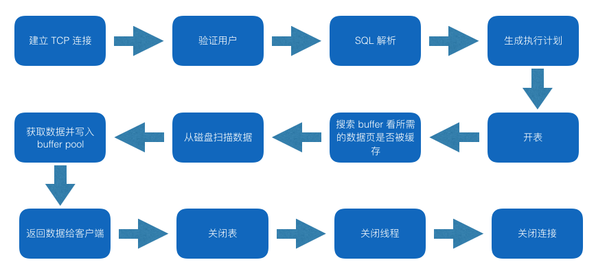
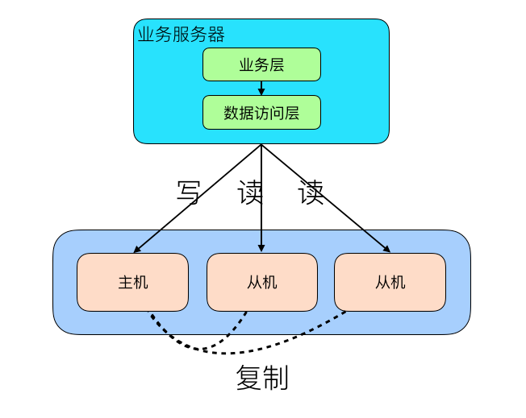
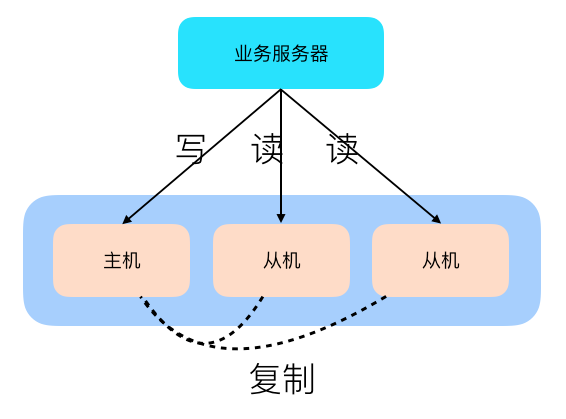
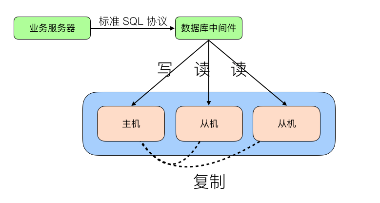

## 数据库分类

    数据库大致可以分为传统的关系型数据库 mysql oracle sqlserver postgresql等
非关系型数据库 hbase(列式数据库) mongodb 文档型数据库 redis 高性能kv存储 lucene 搜索引擎等

数据库查询开销



这个中间耗时操作有 建立TCP链接 生成执行计划 开表 从磁盘扫描数据 关闭链接

在mysql中间 主键查询是最为高效的一类查询 

索引字段如果太长 会导致order by无法在内存中见完成排序 使用mysql磁盘排序 并没有使用索引的排序

在mysql中间 数据按照页的方式来组织 默认大小16KB 包括页头 页尾 中间是记录 
如果表中间存在大字段 达到了甚至超过了单页的大小 这个时候db就会新开一个数据页 当前页通过指针指向该页 一页不够 就会不断增加数据页直到可以存下为止 那么这个时候查询开销是很大的  严重的时候导致热页换出 引起系统抖动 ， 

用了缓存 可能会有 缓存命中 缓存穿透 缓存失效 缓存一致性问题 

读写分离的原理就是将数据库读写操作分散到不同的节点上 



1. 数据库服务器搭建主从集群 主负责写操作 从负责读操作  主复制将数据同步到从 
引入读写分离之后 可能导致 主从复制延迟 分配机制问题

主从复制延迟可能达到秒级别 如果数据量大 可能达到分钟级别 
读写操作区分 访问不同数据库 一般有两种方式： 程序代码封装 或者 中间件封装 
程序代码封装：


这个做法无法多语言通用 主从切换 需要手动修改配置 

中间件封装：
地理一套系统出来 实现读写分离和数据库服务器连接的管理 中间件对业务服务器提供sql兼容的协议 业务服务器无需自己进行读写分离 



读写分离 分散了读写的压力 但是没有分散存储的压力 当数据量上来之后 单台数据库服务器的存储能力就会变成瓶颈 读写能力下降 数据文件备份和恢复困难

垂直分表： 将表中间不常用的占用大量空间的列拆分出去 代价是操作表的数量增加 
水平拆分： 适合行数较大的表 会导致更多的复杂度 join count等 