### 常见的并发模型[Fork/Join   Reactor  Proactor   Actor  CSP]

并发和并行都是相对于进程和线程来说的，并发是指一个或者若干个CPU对多个进程或者线程之间进行多路复用 就是cpu轮着执行多个任务 每个任务执行一段时间 并行则是指多个进程或者线程同一时刻被执行 是真正意义的同时执行 必须多个cpu的支持 

如果 对于并发来说 是线程一执行一段时间 二执行一段时间 三再执行一段时间 没个线程轮流的到cpu的执行时间 这种情况只需要一个cpu就可以实现 对于并行来说 线程一二三是同时执行 需要三个cpu ，当然 并发和并行都提升了cpu的资源利用效率 

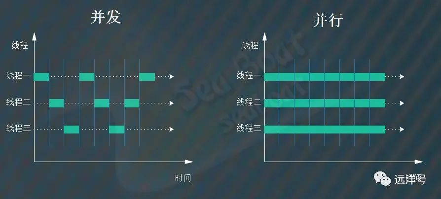

#### 关于并发模型
	
拥有多个cpu的现代计算机 依靠并发并行机制能更快的执行任务 但是如何通过并发并行来执行一个任务也有多种不同的方式 就是不同的并发模型, 不同的并发模型对任务的拆分也是不同的 线程之间的通信方式也是不同的, 由于并发模型规定了任务描述 执行方式和线程协作等的总体框架 所以并发模型设计 需要考虑 如简化对任务的描述 让并发高效 让开发人员更加方便实现并发 

任务模型:

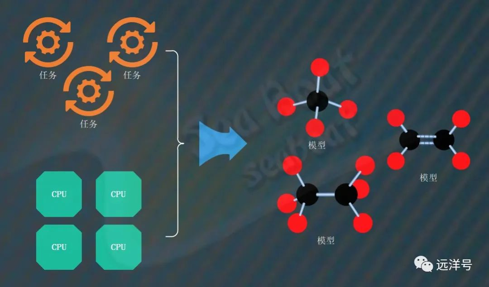

从进程与线程角度
 
 对于并发模型 如果我们从进程和线程的角度来看 主要有三种映射模式
1. 单进程-多线程
2. 多进程-单线程
3. 多进程-多线程 
一般来说 进程的颗粒度大而且占用资源多 线程则是轻量级的 颗粒度小 

单进程-多线程
这种映射模式是指一个进程包含多个线程来执行任务 这是最常见的模式 一般来说 当线程数量少于cpu个数的时候 一个cpu对应一个线程 提高cpu的使用率 还有 多个线程共享进程内部资源 需要考虑线程安全问题 

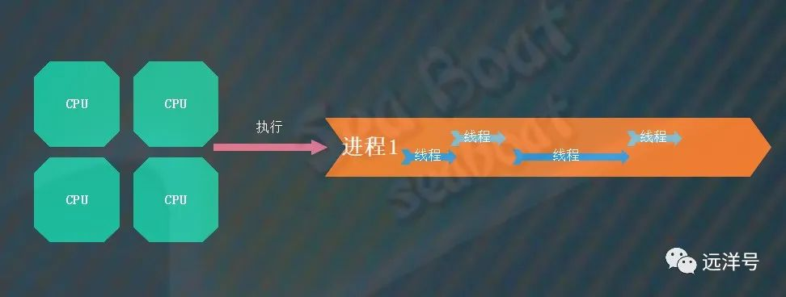

多进程-单线程
这种映射模式是指多个进程共同执行处理任务 每个进程内部只有一个线程 也就是程序启动之后 主进程创建多个子进程 每个字进程对应一个线程 这种模式下不存在线程安全问题 因为每个线程之间相互隔离 进程内部只有一个线程不存在共享内存问题

 
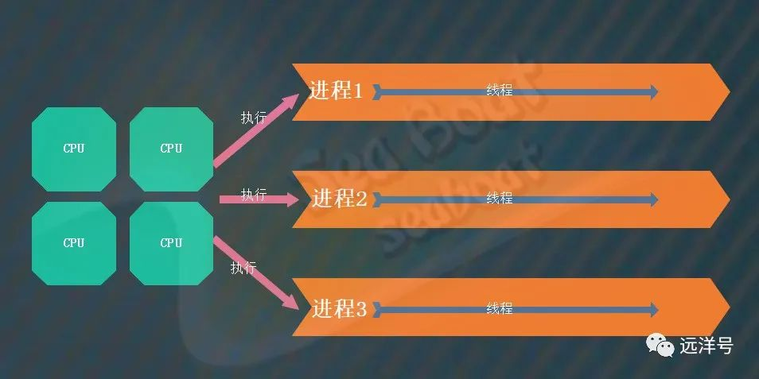

多进程-多线程
这个模式结合了前面两种模式 多个进程共同执行任务 每个进程包含多个线程 一个进程最多能够包含的线程数量是有限的 包含太多也可能导致性能下降 这时候就引入多个进程 就是多进程多线程模式 这种模式也需要考虑线程安全问题 进程和线程切换 一般认为这种模式增加了并发处理能力 特别是对于IO密集任务 但是更多的上下文切换 所以对cpu密集型任务处理能力不一定更高 



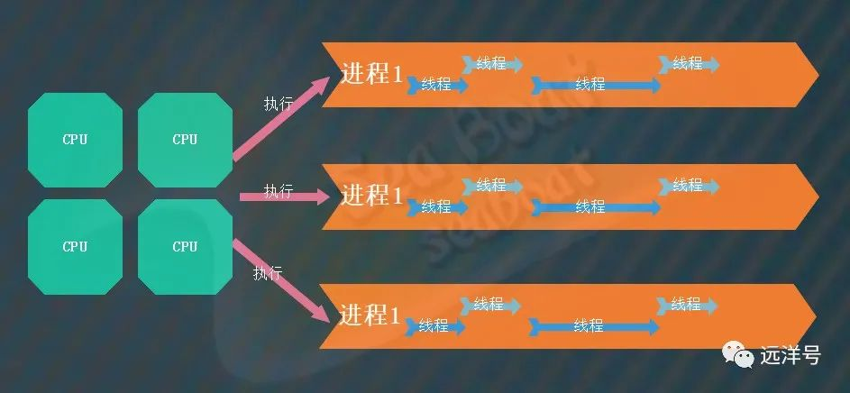

无状态的并发并行
为了使用并行并发机制 我们会把大任务拆分成小任务 当我们拆分后的任务不涉及共享状态的时候 无状态也就代表多个进程和线程不需要访问共享数据 这时候并发并行就简单 不需要考虑线程安全问题 


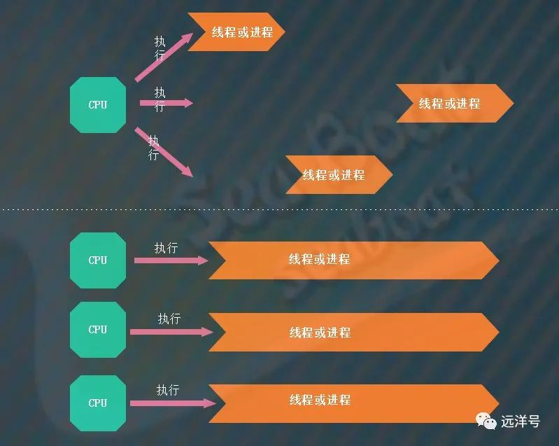

共享状态问题
相对于无状态 并发并行的时候更多的是需要访问共享数据的情况 这个时候就存在共享状态问题 最常见的就是共享数据保存在内存当中 当然也可能保存在数据库或者其他存储系统上 一旦涉及到共享状态问题 就会涉及到竞争条件 死锁和并发问题 而且对共享状态的不同访问策略也可能影响执行的结果  而且 数据从内存到cpu中间会经历高速缓存和寄存器 这就扯出了数据可见性的问题 
 
上面是并发过程中多个线程会访问共享状态，而下面是并行过程中多个线程访问共享状态


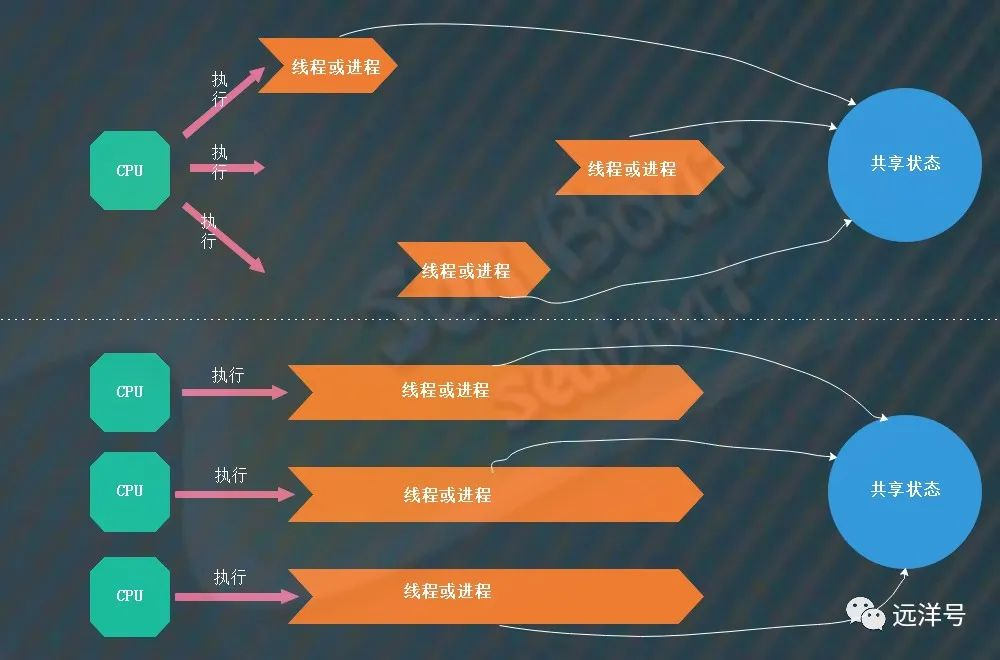

#### 并发模型设计

之前说并发模型设计需要考虑的主体是cpu和任务 并发模型则是规定了任务描述 执行方式和线程协作的整体框架 

#### Fork/Join模型
这个模型其实就是一种分治思想 将任务不断分解成小的任务 执行完成之后将任务结果汇总 Fork操作就是分割任务 Join操作就是合并结果 其实车不多就是和合并排序的做法 相似

就像这个图 任务-1是总任务 fork分割 不断分割 ，然后分割的任务执行完成又join操作将任务结果一层层的向上传递 最终汇总为总任务的最终结果


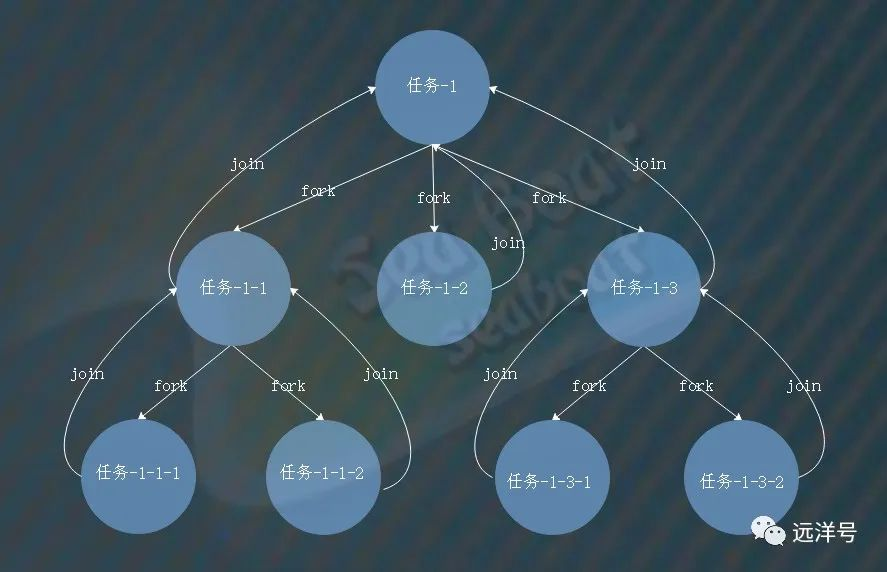

#### Reactor模型
是一种服务器端的模型 能够处理多个客户端并发请求访问 需要非阻塞机制的支持 Reactor模型将服务器端的整个处理过程分成若干事件 然后事件分发器会检测事件并将事件分发给相应的处理器处理 每个处理器仅仅负责自己的事情 而且要让所有的处理器都不产生阻塞 理想状态下每个事件处理器都能充分利用cpu

如图 若干客户端访问服务器 reactor事件分发器检测事件并将各种事件分发到对应的处理器处理 这个过程中如果有带处理的时间存在 就可以让reactor线程不断往下执行 而不会阻塞在一个地方 所以效率高 


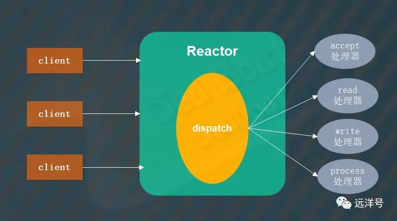

#### Proactor模型

也是基于事件分发机制 但是Recator模型需要自己检测接收读写事件  一旦检测到可接受可读可写的事件就分发到各类处理器 但是Proactor模型是将分发器注册到操作系统内核 内核一旦完成某类事件就通知分发器 然后分发器再分发到各类处理器上/ 两者最大的不同是对IO的操作方式 Reactor是基于应用层发起的同步IO操作 但是Proactor是基于内核的异步IO操作 ，应用层先注册到内核并由内核负责事件通知 

首先应用层创建分发器Dispatcher并且注册到内核异步IO处理器中间 它能感知已经完成接收操作 已完成读操作 已完成写操作等事件 
然后当有相应事件发生时内核会通知分发器 进而调用对应的处理Handler进行处理 如果Handler需要读写则可以直接对内核缓冲区进行操作 此时数据肯定是准备好的 


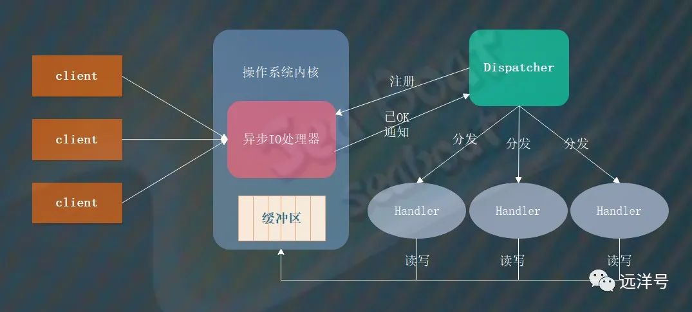

#### Actor模型
该模型实际提供了一种更高层次的并发语义 通过该模型我们可以通过Actor实体概念来进行并发编程 这些Actor之间通过邮箱传递消息 简单来说
就是每个Actor里面都有自己的状态 行为和邮箱 接收到消息后会执行相应的行为进行逻辑处理 然后最重要的是Actor之间是不共享状态的 
Actor模型出现之后 就不必接触多线程和线程池之类的基础概念 只需要将重心放在逻辑处理和消息传递上面  这是一种简化并发编程的方式  Actor通过不共享状态和消息传递来屏蔽这些复杂的问题 

实际上 任何物体都可以抽象为Actor 每个actor都有自己的状态 行为和邮箱 由于Actor之间完全独立 切状态不共享 所以必须通过邮箱来传递消息 每个Actor实际上可以看成是一个轻量级的线程 所以每个Actor最多同时进行一个工作 然后还有个很重要的 消息的传递是异步并且消息不可变


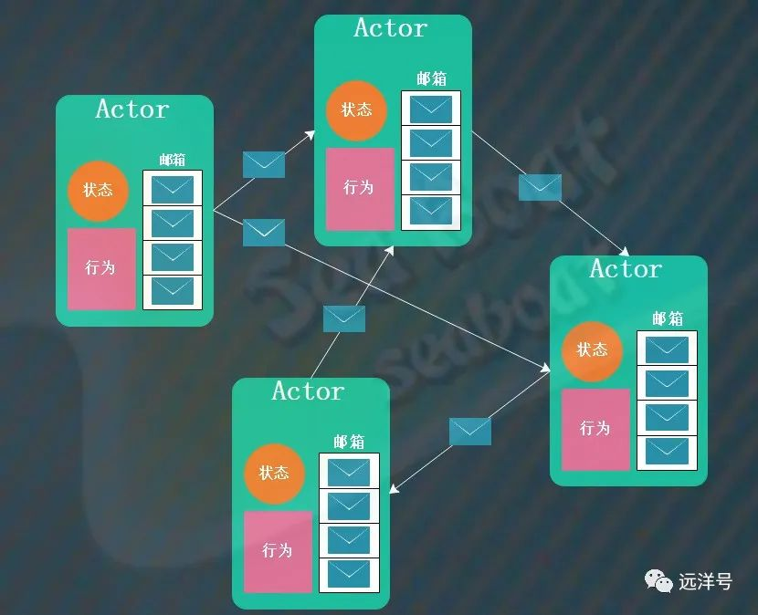

#### CSP模型

Csp模型就是通信顺序进程 看起来和Actor有点像 也是通过消息传递避免并发过程中的锁和同步的问题 从而简化并发编程  CSP模型主要有Processor和Channel两个概念 Processor表示执行任务顺序单元 Channel就是消息交互通道 可以传递数据消息  每个Processor之间相互独立
通过channel来通信 Actor模型中间每个Actor包含一个邮箱 是强耦合，但是CSP模型中间 Processor不包含Channel 他们之间是相互解耦的 


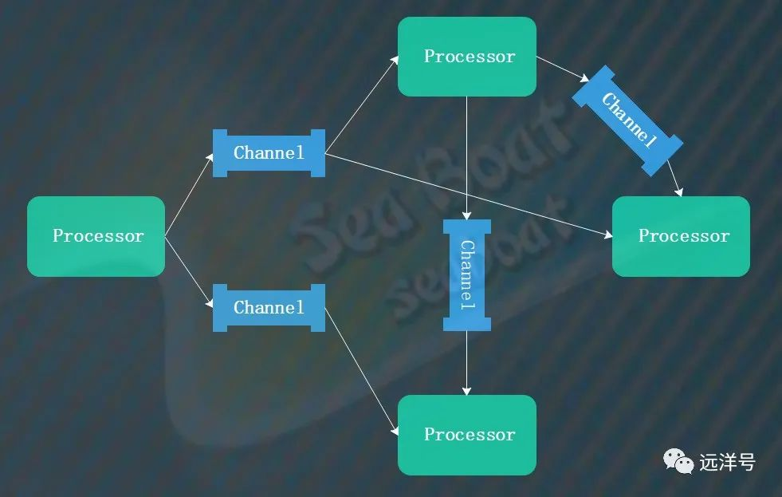
